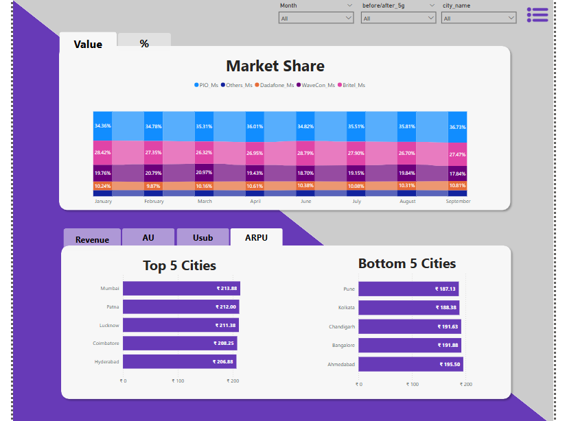
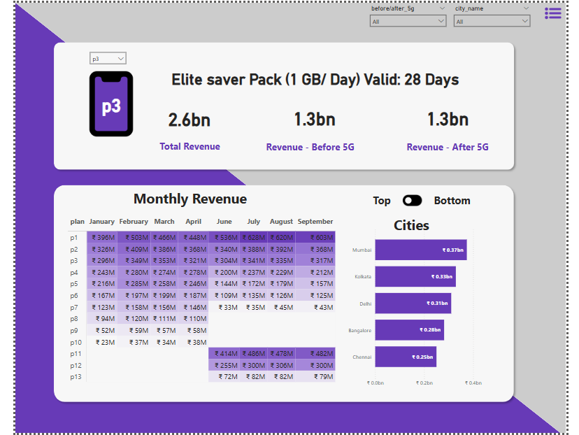

# 📡 Wavecon Telecom - 5G Impact Analysis

## 📌 About

This project explores the impact of Wavecon Telecom’s 5G rollout using Power BI. It analyzes key business metrics such as revenue, user activity, and plan performance before and after the 5G launch to uncover insights and guide strategic decisions.

---

## 🧠 Objective

To understand how the 5G launch affected Wavecon’s business across different cities, plans, and user KPIs.  
We aimed to answer strategic questions using data-driven insights and intuitive dashboard visuals.

---

## ❓ Business Questions Answered

1. **What is the impact of the 5G launch on our revenue?**  
   - Revenue dropped slightly by **0.50%** post-launch (₹16.0B → ₹15.9B).

2. **Which KPI is underperforming after the 5G launch?**  
   - Decline in **Total Active Users (-8.28%)**  
   - Increase in **Unsubscribed Users**

3. **Which plans are performing well or poorly post-5G?**  
   - ✅ **Plan P1** performed best  
   - ❌ **Plans P5, P6, P7** saw major drops in revenue

4. **Should any plan be discontinued?**  
   - Recommend discontinuing **Plan P7** due to 73% revenue decline.

5. **What plans were discontinued and why?**  
   - **P8, P9, P10** discontinued due to short validity and poor user interest post-5G.

---

## 📊 KPIs Tracked

| KPI                        | Value         |
|---------------------------|---------------|
| Total Revenue             | ₹31.9 Billion |
| Average Revenue Per User  | ₹200.7        |
| Total Active Users (TAU)  | 161.7M        |
| Unsubscribed Users        | 12.6M         |

---

## 🌍 City-Level Insights

- 📈 Revenue Growth: Lucknow, Patna, Raipur  
- 📉 Revenue Decline: Delhi, Chennai, Ahmedabad  
- Mumbai and Kolkata remained strong markets.

---

## 🖥 Dashboard Highlights

- Dynamic filters by **City**, **Month**, and **Plan**
- Visuals for:
  - Revenue Trend (Pre/Post 5G)
  - Plan-wise Comparison
  - KPI Cards
  - Market Share & Plan Discontinuation

---

## 🛠 Tools Used

- **Power BI** – Data Visualization

---

## 🗂 Repository Structure

wavecon-telecom-5g-impact-analysis/ ├── Main KPI.png ├── Market.png ├── Plan.png └── README.md

---

**Ekanshi Saxena**  
🎓 Aspiring Data Analyst   

- 💼 [LinkedIn](https://www.linkedin.com/in/ekanshisaxena/)
- 💻 [GitHub](https://github.com/its-ekanshi)

---

> ✨ *Turning telecom data into powerful insights — one dashboard at a time!*

